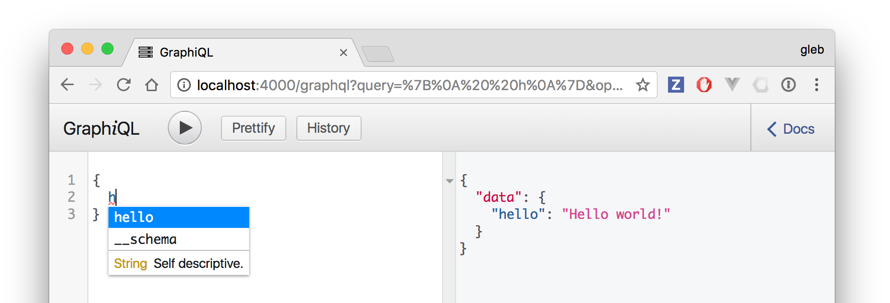

# try-graphql-node

Example code based on tutorial http://graphql.org/graphql-js/

## Plain request

Start the server and try a GET HTTP request

```sh
$ http :4000/graphql
HTTP/1.1 400 Bad Request
Connection: keep-alive
Content-Length: 53
Content-Type: application/json; charset=utf-8
Date: Fri, 16 Jun 2017 14:35:26 GMT
ETag: W/"35-rkfaW07yp80JIwkYI6hoaXIO3bI"
X-Powered-By: Express

{
    "errors": [
        {
            "message": "Must provide query string."
        }
    ]
}
```

## Editor

Just load http://localhost:4000/graphql and let it run! It has live introspection and
is showing the available properties


